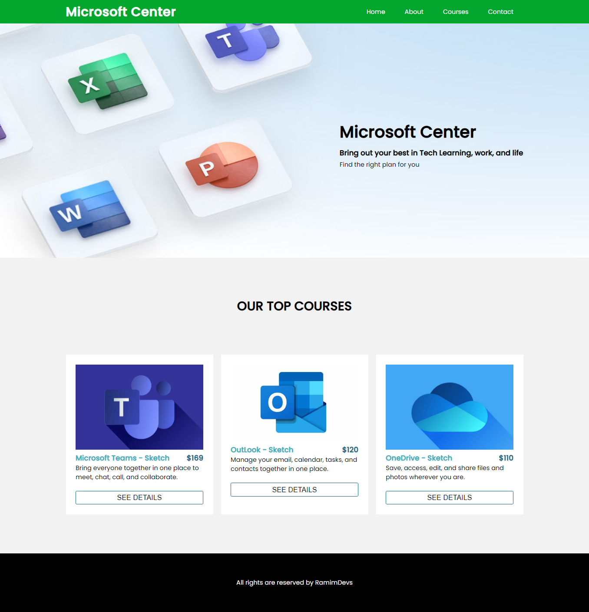
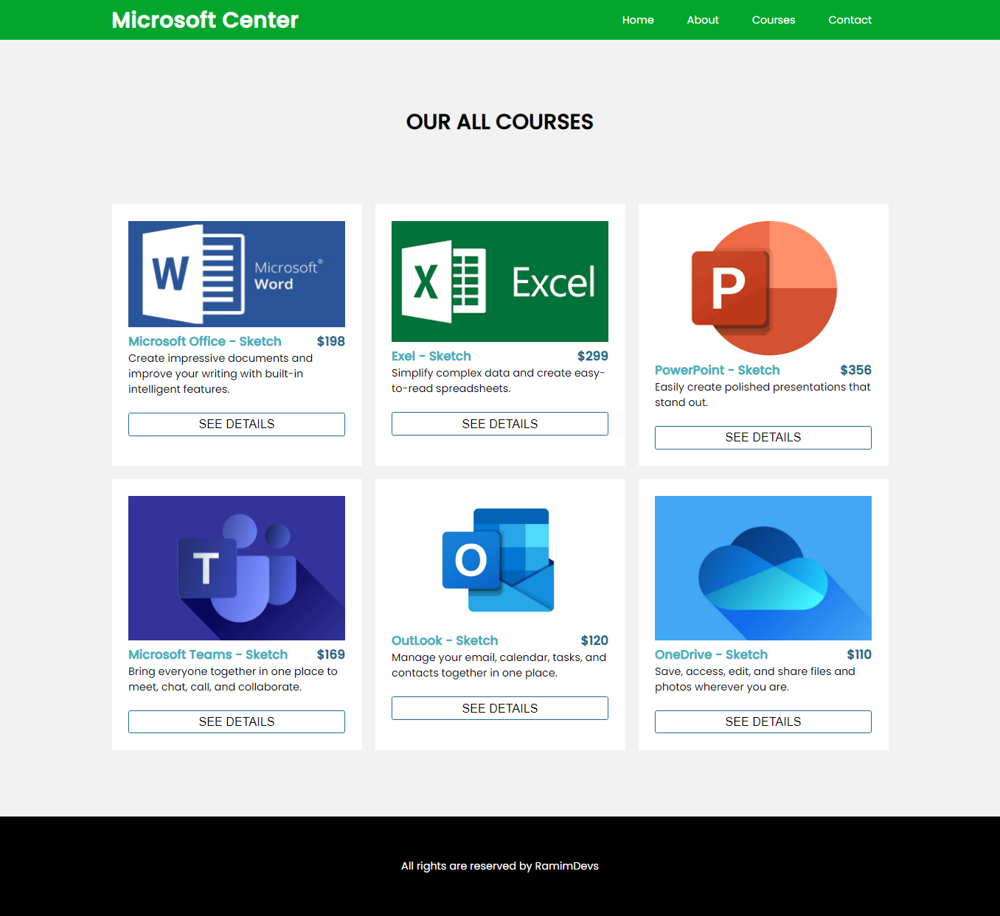
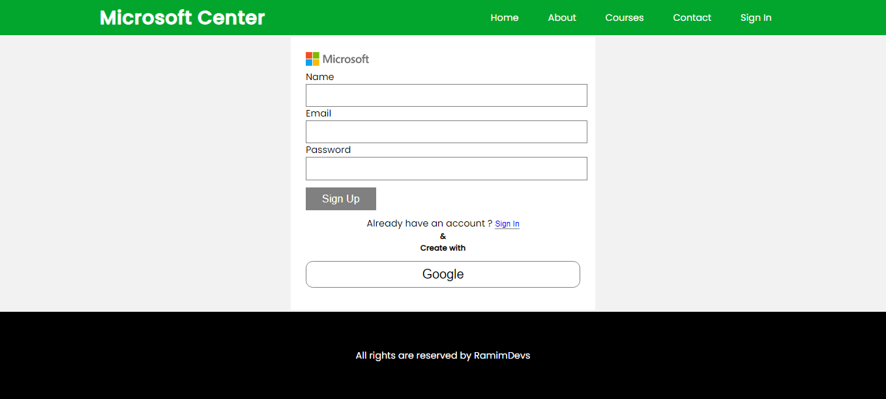

# Microsoft-Center Projects

Project Preview : <a href ="https://microsoft-center.netlify.app/">Live Preview</a>

  
<h3>Features</h3>
<ul>
  <li>Using Json Data</li>
  <li>Using { Map, Find, slice Method}</li>
  <li>Dynamically course details show</li>
</ul>

<h3> Technology I have used.. </h3>
<ul>
  <li>ES6</li>
  <li>React JS</li>
  <li>React Router</li>
  <li>Styled Components</li>
</ul>

<h3>Screenshot</h3>
  
  
  

  
  
  

  
  
# microsoft-center-reactjs-firebase
